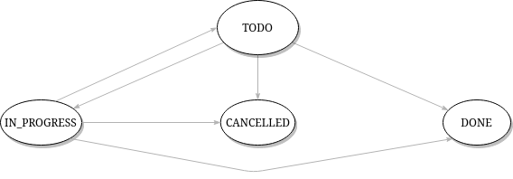

# Hexagonal-kotlin-playground
Purpose of this project is to implement a hexagonal architecture in Kotlin.

This project is a simple tasks manager with some constraints related to state transitions. See [state diagram](#state-diagram) section for details.

The implementation is using the functional programming library [Arrow](https://arrow-kt.io/).

Some benefits to use Arrow are:
- Domain is side effect free;
- Domain is easier to test;
- Composition;
- etc.

The project is composed of multiple gradle sub-projects:
- `domain` (free of any external library except Arrow);
- `infra-web` (containing the web server to start);
- `infra-db` (just to simulate a database adapter).

Therefore, domain and business logic are isolated from any infrastructure code.

Ktor is used as a web server, just to learn something new.

This projects may of course receive improvements such as adding integration tests with Ktor...

## Hexagonal architecture
Our business rules and our domain are isolated from any technical implementation. 
Requests are first validated, then processed if valid.


## State diagram
As shown on the diagram, it is not possible to move a task that is cancelled or done. This is simply to have some 
business rules :)


## Run tests
`./gradlew test`

## Run ktor server
`./gradlew run`

### Requests
The following request are based on [httpie](https://httpie.io/) tool.

#### Get all tasks
```
http :9090/tasks

HTTP/1.1 200 OK
Connection: keep-alive
Content-Encoding: gzip
Content-Type: application/json; charset=UTF-8
Date: Sat, 13 Mar 2021 22:01:51 GMT
Server: ktor-server-core/1.5.2
transfer-encoding: chunked

[
    {
        "content": "The joker war #1",
        "id": "682c1b16-532e-4164-afc3-ae5fd00671af",
        "name": "Read Batman #1",
        "state": "DONE"
    },
    {
        "content": "The joker war #2",
        "id": "4b1de79b-51f3-4825-a55a-29f7d82db92e",
        "name": "Read Batman #2",
        "state": "CANCELLED"
    }
]

```

#### Get task by its id
```
🚀http :9090/tasks/682c1b16-532e-4164-afc3-ae5fd00671af

HTTP/1.1 200 OK
Connection: keep-alive
Content-Encoding: gzip
Content-Type: application/json; charset=UTF-8
Date: Sat, 13 Mar 2021 22:02:17 GMT
Server: ktor-server-core/1.5.2
transfer-encoding: chunked

{
    "content": "The joker war #1",
    "id": "682c1b16-532e-4164-afc3-ae5fd00671af",
    "name": "Read Batman #1",
    "state": "DONE"
}
```

#### Add a new task
```
🚀http PUT :9090/tasks Content-Type:application/json name="Buy Robin #1" content="Do not forget to read it"

HTTP/1.1 201 Created
Connection: keep-alive
Content-Encoding: gzip
Content-Type: application/json; charset=UTF-8
Date: Sat, 13 Mar 2021 22:03:39 GMT
Server: ktor-server-core/1.5.2
transfer-encoding: chunked

{
    "content": "Do not forget to read it",
    "id": "0661ef75-3e57-47d1-b8b0-c90d7be6d653",
    "name": "Buy Robin #1",
    "state": "TODO"
}
```

#### Move a task to IN_PROGRESS (or another state)
```
🚀http POST :9090/tasks/move/0661ef75-3e57-47d1-b8b0-c90d7be6d653 Content-Type:application/json  state=IN_PROGRESS

HTTP/1.1 200 OK
Connection: keep-alive
Content-Encoding: gzip
Content-Type: application/json; charset=UTF-8
Date: Sat, 13 Mar 2021 22:04:23 GMT
Server: ktor-server-core/1.5.2
transfer-encoding: chunked

{
    "content": "Do not forget to read it",
    "id": "0661ef75-3e57-47d1-b8b0-c90d7be6d653",
    "name": "Buy Robin #1",
    "state": "IN_PROGRESS"
}
```

#### Delete a task
```
🚀💥http DELETE :9090/tasks/0661ef75-3e57-47d1-b8b0-c90d7be6d653 Content-Type:application/json

HTTP/1.1 204 No Content
Connection: keep-alive
Content-Encoding: gzip
Content-Type: application/json; charset=UTF-8
Date: Sat, 13 Mar 2021 22:05:32 GMT
Server: ktor-server-core/1.5.2
```

#### Move a task to an invalid state
Bad request will arise when trying to move a task to a state that does not follow
the diagram. For example, moving a DONE task to IN_PROGRESS:

```
🚀 http POST :9090/tasks/move/682c1b16-532e-4164-afc3-ae5fd00671af Content-Type:application/json  state=IN_PROGRESS
HTTP/1.1 400 Bad Request
Connection: keep-alive
Content-Length: 47
Content-Type: text/plain; charset=UTF-8
Date: Sun, 14 Mar 2021 16:24:49 GMT
Server: ktor-server-core/1.5.2

Task has been done and is no longer modifiable.
```

 


